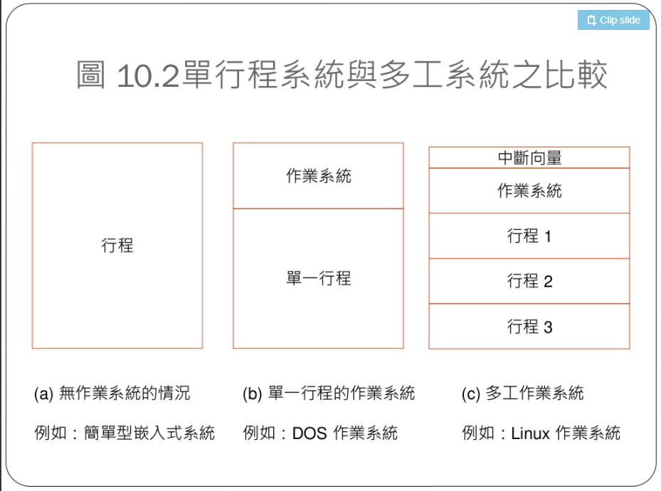
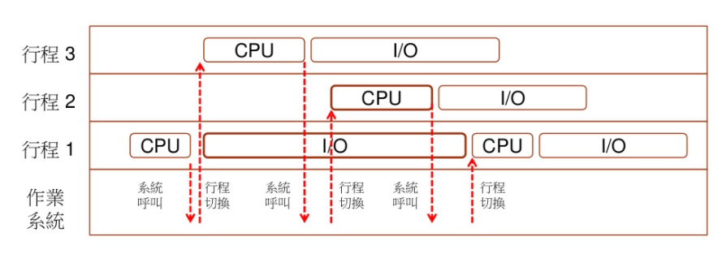
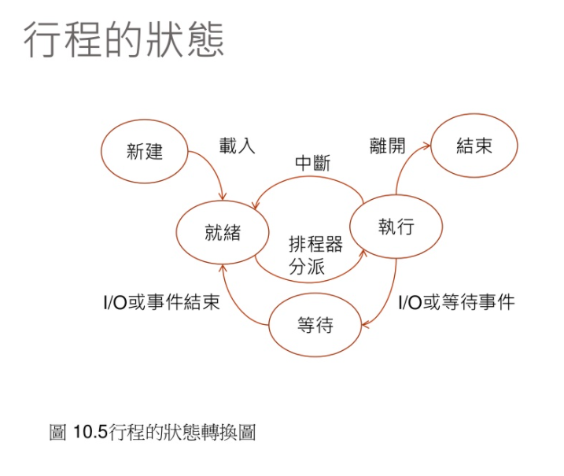

# :memo: 系統程式第十周筆記
## 單形成系統 VS 多工系統

## 多形成系統

## pthread
Pthreads API中大致共有100個函數調用，全都以"pthread_"開頭，並可以分為四類：

執行緒管理，例如創建執行緒，等待(join)執行緒，查詢執行緒狀態等。
Mutex：創建、摧毀、鎖定、解鎖、設置屬性等操作
條件變量（Condition Variable）：創建、摧毀、等待、通知、設置與查詢屬性等操作
使用了讀寫鎖的執行緒間的同步管理
## 常用函式
* 執行緒操縱函數（簡介起見，省略參數）
    * pthread_create()：創建一個執行緒
    * pthread_exit()：終止當前執行緒
    * pthread_cancel()：請求中斷另外一個執行緒的運行。被請求中斷的執行緒會繼續運行，直至到達某個取消點(Cancellation Point)。取消點是執行緒檢查是否被取消並按照請求進行動作的一個位置。POSIX 的取消類型（Cancellation Type）有兩種，一種是延遲取消(PTHREAD_CANCEL_DEFERRED)，這是系統默認的取消類型，即在執行緒到達取消點之前，不會出現真正的取消；另外一種是異步取消(PHREAD_CANCEL_ASYNCHRONOUS)，使用異步取消時，執行緒可以在任意時間取消。系統調用的取消點實際上是函數中取消類型被修改為異步取消至修改回延遲取消的時間段。幾乎可以使執行緒掛起的庫函數都會響應CANCEL信號，終止執行緒，包括sleep、delay等延時函數
    * pthread_join()：阻塞當前的執行緒，直到另外一個執行緒運行結束
    * pthread_kill()：向指定ID的執行緒發送一個信號，如果執行緒不處理該信號，則按照信號默認的行為作用於整個進程。信號值0為保留信號，作用是根據函數的返回值判斷執行緒是不是還活著
    * pthread_cleanup_push()：執行緒可以安排異常退出時需要調用的函數，這樣的函數稱為執行緒清理程序，執行緒可以建立多個清理程序。執行緒清理程序的入口地址使用棧保存，實行先進後處理原則。由pthread_cancel或pthread_exit引起的執行緒結束，會次序執行由pthread_cleanup_push壓入的函數。執行緒函數執行return語句返回不會引起執行緒清理程序被執行
    * pthread_cleanup_pop()：以非0參數調用時，引起當前被彈出的執行緒清理程序執行
    * pthread_setcancelstate()：允許或禁止取消另外一個執行緒的運行
    * pthread_setcanceltype()：設置執行緒的取消類型為延遲取消或異步取消

## race 
* 在多 Thread (或多 CPU) 的情況之下，兩個 thread 可以共用某些變數，但是共用變數可能造成一個嚴重的問題，那就是當兩個 thread 同時修改一個變數時，這種修改會造成變數的值可能錯誤的情況。
* 解決辦法:為了避免這樣的問題產生，一個可能的解決方法是採用鎖定 (lock) 的方式，當我們執行共用變數的修改時，先進行鎖定，讓其他的線程無法同時修改該變數，等到修改完畢後解索後，其他的線程才能修改該變數，這樣就能避免掉競爭情況的問題了。
## deadlock
簡單來說，deadlock就是在process之間，
相互等待其它process資源的情況，
以致於所有的process都無法繼續執行。
## deadlock的四個必要條件
deadlock要發生要滿足以下四個必要條件(也就是若缺少一項就不可能會deadlock):
* Mutual exclusion: 同一時間同個資源只能被一個process所用
* Hold and wait: process手上可以握有資源並等待其它process的資源
* No preemption: process手上的資源只能是自願放掉的，不能被其它process搶走
* Circular wait: 存在多個process(P0, P1, ..., Pn)互相等待資源的情形(P0等P1的資源，P1等P2的資源，…，Pn等P0的資源)
## 如何預防deadlock?
deadlock要發生要滿足以下四個必要條件(也就是若缺少一項就不可能會deadlock):
* Mutual exclusion: 同一時間同個資源只能被一個process所用
* Hold and wait: process手上可以握有資源並等待其它process的資源
* No preemption: process手上的資源只能是自願放掉的，不能被其它process搶走
* Circular wait: 存在多個process(P0, P1, ..., Pn)互相等待資源的情形(P0等P1的資源，P1等P2的資源，…，Pn等P0的資源)