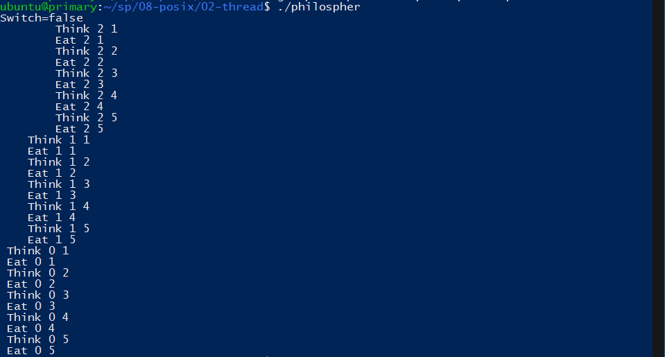
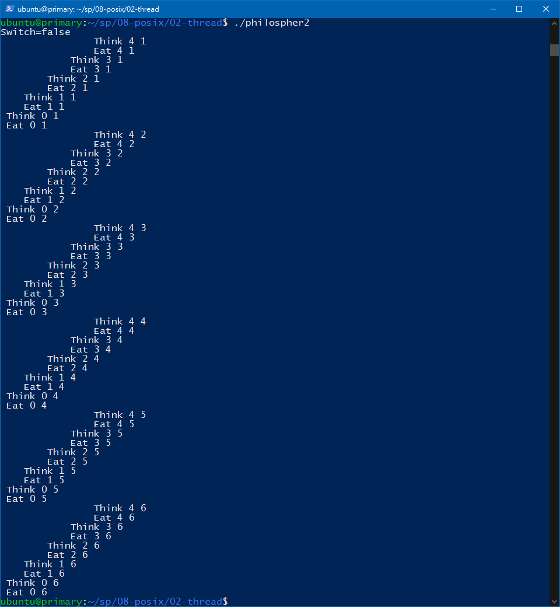

# :memo: 系統程式第十一周筆記

## [生產者消費者問題](https://www.itread01.com/content/1544187007.html)
生產者消費者問題（英語：Producer-consumer problem），也稱有限緩衝問題（Bounded-buffer problem），是一個多進程同步問題的經典案例。該問題描述了共享固定大小緩衝區的兩個進程——即所謂的「生產者」和「消費者」——在實際運行時會發生的問題。生產者的主要作用是生成一定量的數據放到緩衝區中，然後重複此過程。與此同時，消費者也在緩衝區消耗這些數據。該問題的關鍵就是要保證生產者不會在緩衝區滿時加入數據，消費者也不會在緩衝區中空時消耗數據。

要解決該問題，就必須讓生產者在緩衝區滿時休眠（要麼乾脆就放棄數據），等到下次消費者消耗緩衝區中的數據的時候，生產者才能被喚醒，開始往緩衝區添加數據。同樣，也可以讓消費者在緩衝區空時進入休眠，等到生產者往緩衝區添加數據之後，再喚醒消費者。通常採用進程間通信的方法解決該問題，常用的方法有信號燈法[1]等。如果解決方法不夠完善，則容易出現死鎖的情況。出現死鎖時，兩個執行緒都會陷入休眠，等待對方喚醒自己。該問題也能被推廣到多個生產者和消費者的情形。
## semaphore
Semaphore 是一種用來限制可以同時取用共享 (受保護) 資源的 task 數量的方法。受保護的資源或關鍵程式區塊可能包括寫入全域變數或與外部儀器通訊。您可以使用 Semaphore 使您的程式碼 thread-safe，並避免競賽效應。Semaphore 類似於其他程式語言中的 mutex (Mutual exclusion)。

它對於保護不應被同時呼叫的兩個或多個關鍵程式碼片段很有用。在進入關鍵程式片段之前，執行序必須取得 Semaphore。如果關鍵程式片段中沒有執行序，則執行序會立即進入該程式片段。一旦關鍵程式片段執行完畢，該執行序必須釋放 Semaphore。其他想要進入該關鍵程式片段的執行序必須等到第一個執行序釋放 Semaphore。

## producerConsumer

## phliospher
