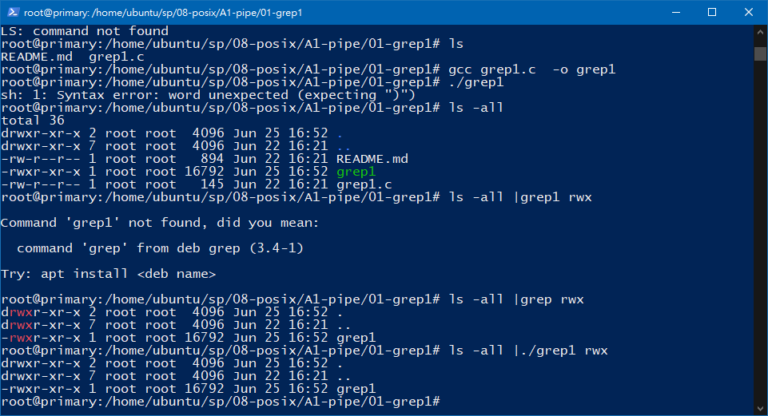
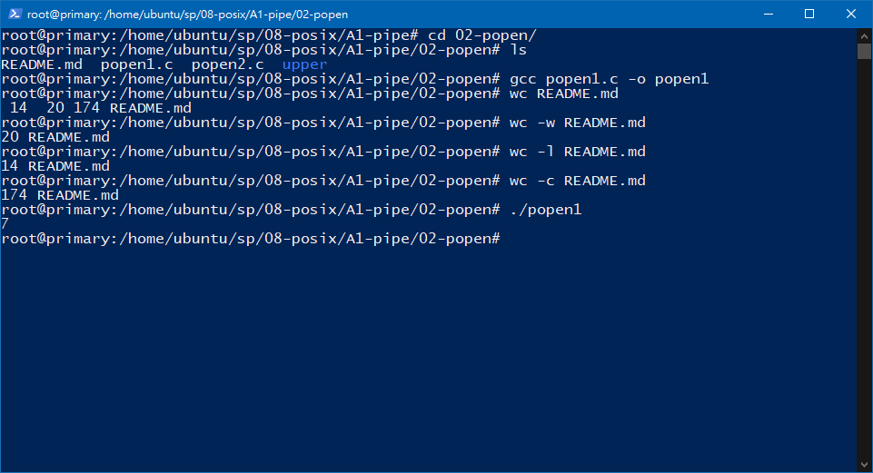
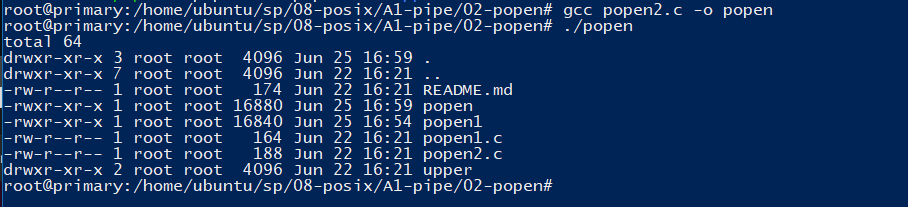
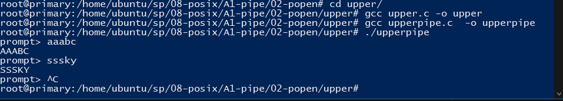
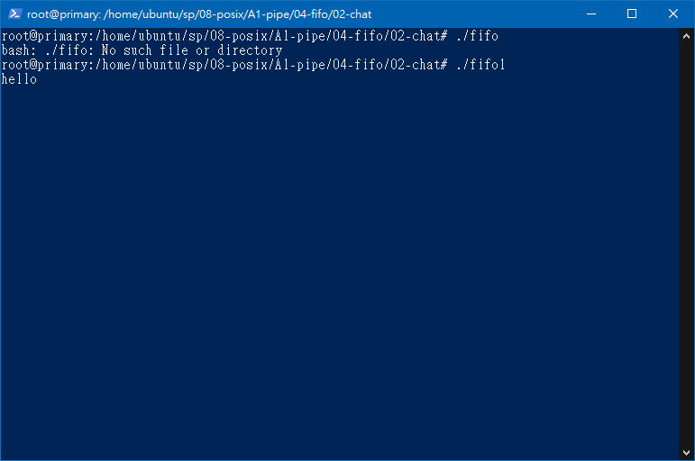
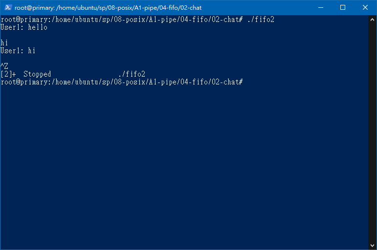
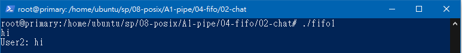
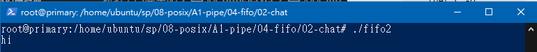

# :memo: 系統程式第十四周筆記

## 程式實作
### helloWebServer
```
user@user-myubuntu:~/sp/08-posix/06-net/05-http$ make
gcc -std=c99 -O0 helloWebServer.c ../net.c -o helloWebServer
gcc -std=c99 -O0 headPrintServer.c ../net.c -o headPrintServer
gcc -std=c99 -O0 htmlServer.c ../net.c httpd.c -o htmlServer
user@user-myubuntu:~/sp/08-posix/06-net/05-http$ ./helloWebServer 
Server started at port: 8080
0:got connection, client_fd=4
1:got connection, client_fd=4
```

## htmlServer
``` 
user@user-myubuntu:~/sp/08-posix/06-net/05-http$ ./htmlServer 
Server started at port: 8080
===========header=============
GET / HTTP/1.1
Host: localhost:8080
User-Agent: curl/7.68.0
Accept: */*


path=/
not html => no response!
===========header=============
GET /index.html HTTP/1.1
Host: localhost:8080
User-Agent: curl/7.68.0
Accept: */*


path=/index.html
path contain .htm
responseFile:fpath=./web/index.html
===========header=============
GET /hello.html HTTP/1.1
Host: localhost:8080
User-Agent: curl/7.68.0
Accept: */*


path=/hello.html
path contain .htm
responseFile:fpath=./web/hello.html

```

### grep 


### popen1


### popen2


### upperpipe


### pipe1


### pipe2


### fifo



