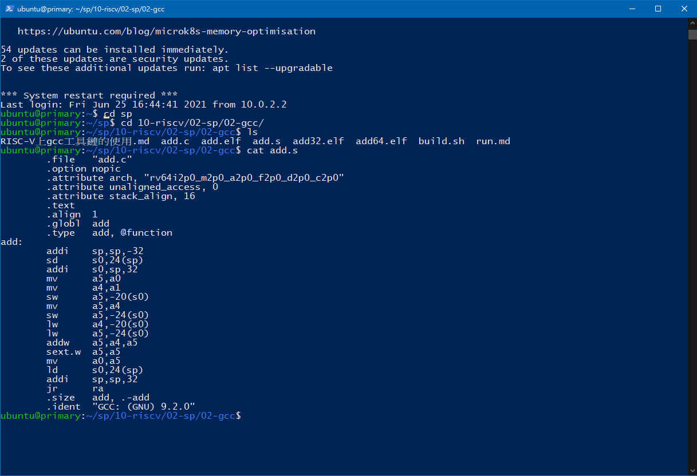
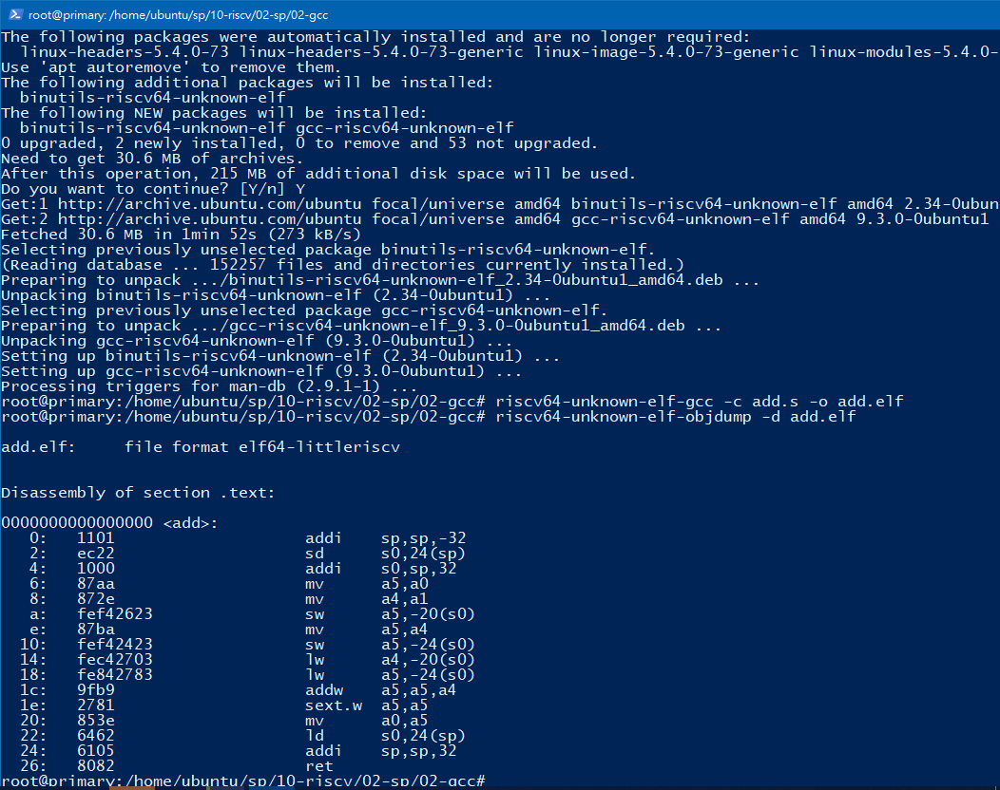
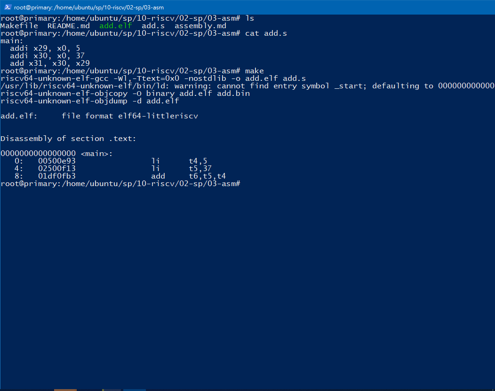
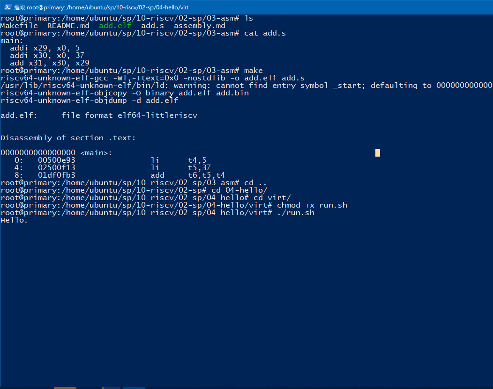

# :memo: 系統程式第十七周筆記
## 程式實作
### gcc


### elf格式檔，objdump 反組譯


### asm


### virt


### HelloOS
```

guest@localhost:~/sp/10-riscv/03-mini-riscv-os/01-HelloOs$ make
riscv64-unknown-elf-gcc -nostdlib -fno-builtin -mcmodel=medany -march=rv32ima -mabi=ilp32 -T os.ld -o os.elf start.s os.c
guest@localhost:~/sp/10-riscv/03-mini-riscv-os/01-HelloOs$ make qemu
Press Ctrl-A and then X to exit QEMU
qemu-system-riscv32 -nographic -smp 4 -machine virt -bios none -kernel os.elf
Hello OS!
QEMU: Terminated
```
### ContextSwitch
```
guest@localhost:~/sp/10-riscv/03-mini-riscv-os/02-ContextSwitch$ make
riscv64-unknown-elf-gcc -nostdlib -fno-builtin -mcmodel=medany -march=rv32ima -mabi=ilp32 -T os.ld -o os.elf start.s sys.s lib.c os.c
guest@localhost:~/sp/10-riscv/03-mini-riscv-os/02-ContextSwitch$ make qemu
Press Ctrl-A and then X to exit QEMU
qemu-system-riscv32 -nographic -smp 4 -machine virt -bios none -kernel os.elf
OS start
Task0: Context Switch Success !
QEMU: Terminated
```
### MultiTasking
```
guest@localhost:~/sp/10-riscv/03-mini-riscv-os/03-MultiTasking$ make
riscv64-unknown-elf-gcc -nostdlib -fno-builtin -mcmodel=medany -march=rv32ima -mabi=ilp32 -T os.ld -o os.elf start.s sys.s lib.c task.c os.c user.c
guest@localhost:~/sp/10-riscv/03-mini-riscv-os/03-MultiTasking$ make qemu
Press Ctrl-A and then X to exit QEMU
qemu-system-riscv32 -nographic -smp 4 -machine virt -bios none -kernel os.elf
OS start
OS: Activate next task
Task0: Created!
Task0: Now, return to kernel mode
OS: Back to OS

OS: Activate next task
Task1: Created!
Task1: Now, return to kernel mode
OS: Back to OS

OS: Activate next task
Task0: Running...
OS: Back to OS

OS: Activate next task
Task1: Running...
OS: Back to OS
QEMU: Terminated
```
### TimerInterrupt
```
guest@localhost:~/sp/10-riscv/03-mini-riscv-os/04-TimerInterrupt$ make
riscv64-unknown-elf-gcc -nostdlib -fno-builtin -mcmodel=medany -march=rv32ima -mabi=ilp32 -T os.ld -o os.elf start.s sys.s lib.c timer.c os.c
guest@localhost:~/sp/10-riscv/03-mini-riscv-os/04-TimerInterrupt$ make qemu
Press Ctrl-A and then X to exit QEMU
qemu-system-riscv32 -nographic -smp 4 -machine virt -bios none -kernel os.elf
OS start
timer_handler: 1
timer_handler: 2
timer_handler: 3
timer_handler: 4
timer_handler: 5
timer_handler: 6
timer_handler: 7
timer_handler: 8
timer_handler: 9
timer_handler: 10
timer_handler: 11
timer_handler: 12
QEMU: Terminated
```
### Preemptive
```
guest@localhost:~/sp/10-riscv/03-mini-riscv-os/05-Preemptive$ make
riscv64-unknown-elf-gcc -nostdlib -fno-builtin -mcmodel=medany -march=rv32ima -mabi=ilp32 -T os.ld -o os.elf start.s sys.s lib.c timer.c task.c os.c user.c trap.c
guest@localhost:~/sp/10-riscv/03-mini-riscv-os/05-Preemptive$ make qemu
Press Ctrl-A and then X to exit QEMU
qemu-system-riscv32 -nographic -smp 4 -machine virt -bios none -kernel os.elf
OS start
OS: Activate next task
Task0: Created!
Task0: Running...
timer interruption!
timer_handler: 1
OS: Back to OS

OS: Activate next task
Task1: Created!
Task1: Running...
timer interruption!
timer_handler: 2
OS: Back to OS

OS: Activate next task
Task0: Running...
timer interruption!
timer_handler: 3
OS: Back to OS

OS: Activate next task
Task1: Running...
timer interruption!
timer_handler: 4
OS: Back to OS

OS: Activate next task
Task0: Running...
timer interruption!
timer_handler: 5
OS: Back to OS

OS: Activate next task
Task1: Running...
QEMU: Terminated
```

