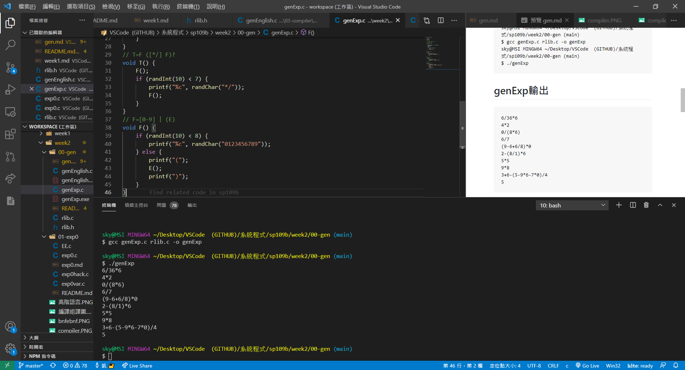
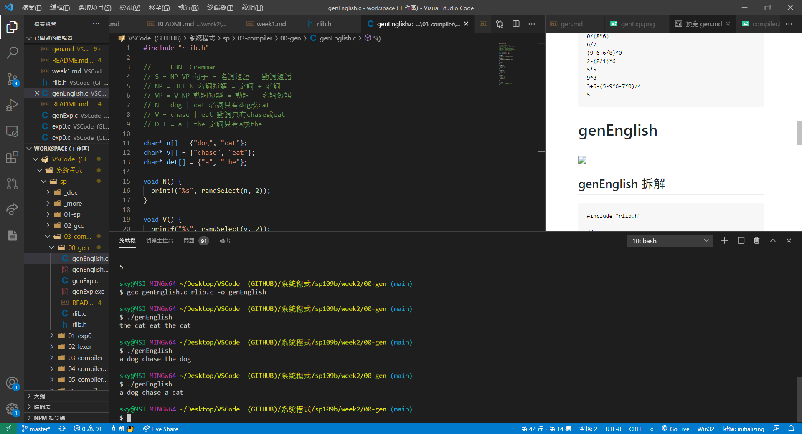

# genExp 


## genExp 拆解
```
#include "rlib.h"

void E();
void T();
void F();

// === EBNF Grammar =====
// E=T ([+-] T)*
// T=F ([*/] F)?
// F=[0-9] | (E)

int main(int argc, char * argv[]) {
	timeSeed();
	E();
	int i;
	for (i=0; i<10; i++) {
		E();
		printf("\n");
	}
}
// E=T ([+-] T)*
void E() {
    T();
	while (randInt(10) < 3) {
       printf("%c", randChar("+-"));
	   T();
	}
}
// T=F ([*/] F)?
void T() {
    F();
	if (randInt(10) < 7) {
		printf("%c", randChar("*/"));
		F();
	}
}
// F=[0-9] | (E)
void F() {
    if (randInt(10) < 8) {
		printf("%c", randChar("0123456789"));
	} else {
		printf("(");
		E();
		printf(")");
	}
}
```
## genExp 操作

```
sky@MSI MINGW64 ~/Desktop/VSCode  (GITHUB)/系統程式/sp109b/week2/00-gen (main)
$ gcc genExp.c rlib.c -o genExp
sky@MSI MINGW64 ~/Desktop/VSCode  (GITHUB)/系統程式/sp109b/week2/00-gen (main)
$ ./genExp
```
## genExp輸出
```
6/36*6
4*2
0/(8*6)
6/7
(9-6+6/8)*0
2-(8/1)*6
5*5
9*8
3+6-(5-9*6-7*0)/4
5
```

# genEnglish


## genEnglish 拆解
```
#include "rlib.h"

// === EBNF Grammar =====
// S = NP VP 句子 = 名詞短語 + 動詞短語
// NP = DET N 名詞短語 = 定詞 + 名詞
// VP = V NP 動詞短語 = 動詞 + 名詞短語
// N = dog | cat 名詞只有dog或cat
// V = chase | eat 動詞只有chase或eat
// DET = a | the 定詞只有a或the

char* n[] = {"dog", "cat"};
char* v[] = {"chase", "eat"};
char* det[] = {"a", "the"};

void N() {
  printf("%s", randSelect(n, 2));
}

void V() {
  printf("%s", randSelect(v, 2));
}

void DET() {
  printf("%s", randSelect(det, 2));
}

void NP() {
  DET(); //第23行
  printf(" ");
  N(); //第15行
}

void VP() {
  V(); //第8行
  printf(" ");
  NP(); 
}

void S() {
  NP(); //第27行
  printf(" ");
  VP(); //第33行
  printf("\n");    
  
}

int main() {
  timeSeed(); //rlib.c
  S(); //第3行解釋與第39行程式
}
```
## genEnglish 操作
```
sky@MSI MINGW64 ~/Desktop/VSCode  (GITHUB)/系統程式/sp109b/week2/00-gen (main)
$ gcc genEnglish.c rlib.c -o genEnglish

sky@MSI MINGW64 ~/Desktop/VSCode  (GITHUB)/系統程式/sp109b/week2/00-gen (main)
$ ./genEnglish
```
## genExp輸出
```
the cat eat the cat
a dog chase the dog
a dog chase a cat
```
