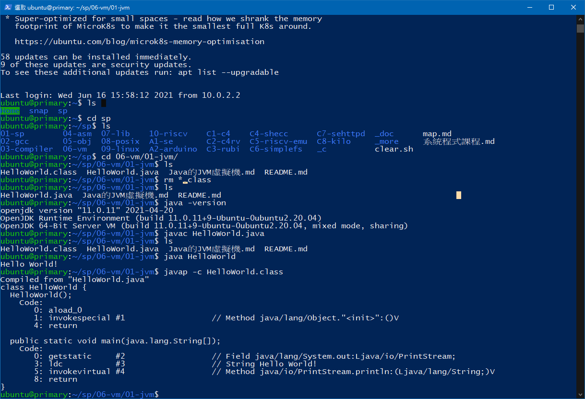
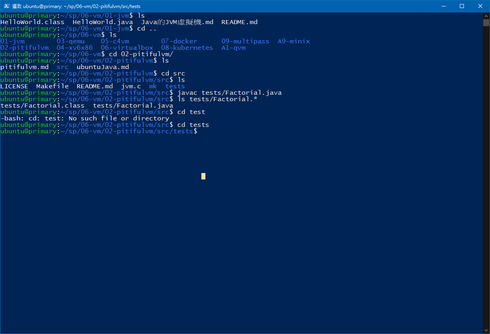

## :memo: 系統程式第五周筆記

### 虛擬機VS模擬器
虛擬機:模擬處理器指令集的軟體，有模擬cpu指令集<br>
模擬器:模擬電腦行為的軟體

### 虛擬機架構
1. 記憶體機 memory 
2. 暫存器機 register
3. 堆疊機 stack

### stack 
```
PUSH B, 
PUSH X, 
ADD, 
POP C, 
PUSH C, 
PUSH Y, 
SUB, 
POP Z 
```


### JAVAVM TEST



### C4 compiler
* https://github.com/rswier/c4
* https://www.zhihu.com/question/28249756