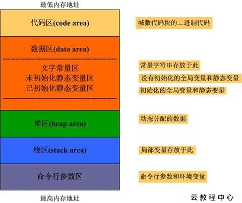
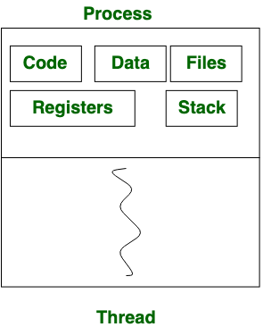
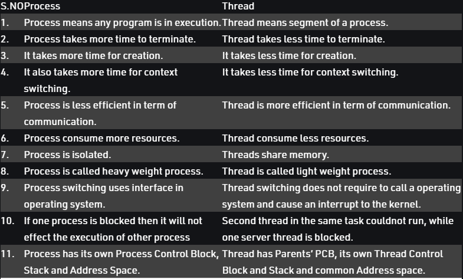

# :memo: 系統程式第九周筆記
## C語言記憶體分佈圖

## process VS thread
Process: 
Process means any program is in execution. Process control block controls the operation of any process. Process control block contains information about processes for example Process priority, process id, process state, CPU, register, etc. A process can creates other processes which are known as Child Processes. Process takes more time to terminate and it is isolated means it does not share memory with any other process. 
 
The process can have the following states like new, ready, running, waiting, terminated, suspended. 
 
Thread: 
Thread is the segment of a process means a process can have multiple threads and these multiple threads are contained within a process. A thread have 3 states: running, ready, and blocked. 
 
Thread takes less time to terminate as compared to process and like process threads do not isolate. 
 

## different

