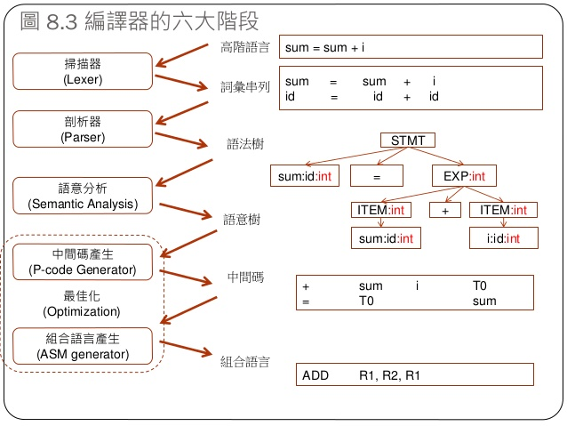
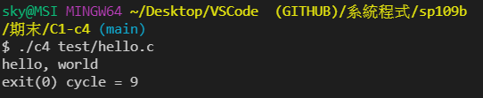
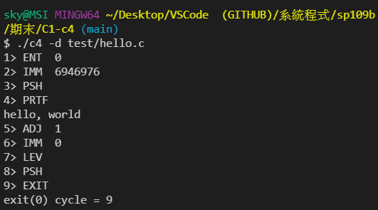

#  Final Project :c4 compiler
## 專案參考
[C4 -- 500 行的 C 語言編譯器 
修改者 -- 陳鍾誠
](https://gitlab.com/ccc109/sp/-/tree/master/C1-c4)
# 簡介 -- C4 編譯器 

[C4](https://github.com/rswier/c4) 是 [Robert Swierczek](https://github.com/rswier/) 寫的一個小型 C 語言編譯器，全部 527 行的原始碼都在 [c4.c](https://github.com/cccbook/c4/blob/master/c4.c) 裏 。

C4 編譯完成後，會產生一種《堆疊機機器碼》放在記憶體內，然後 [虛擬機](vm) 會立刻執行該機器碼。

### compiler structure


### 编譯器的構建流程
構建我們自己的虛擬機以及指令集。這之後生成的目標代碼便是我們的指令集。
建構我们的詞法分析器
建構語法分析器

### 內存
內存用於存儲數據，這裡的數據可以是代碼，也可以是其它的數據。現代操作系統在操作內存時，並不是直接處理”物理內存“，而是操作”虛擬內存“。虛擬內存可以理解為一種映射，它的作用是屏蔽了物理的細節。例如 32 位的機器中，我們可以使用的內存地址為 2^32 = 4G，而電腦上的實際內存可能只有 256 M。操作系統將我們使用的虛擬地址映射到了到實際的內存上。

當然，我們這裡並不需要了解太多，但需要了解的是：進程的內存會被分成幾個段：

代碼段（text）用於存放代碼（指令）。
數據段（data）用於存放初始化了的數據，如int i = 10;，就需要存放到數據段中。
未初始化數據段（bss）用於存放未初始化的數據，如 int i[1000];，因為不關心其中的真正數值，所以單獨存放可以節省空間，減少程序的體積。
棧（stack）用於處理函數調用相關的數據，如調用幀（calling frame）或是函數的局部變量等。
堆（heap）用於為程序動態分配內存。

### 寄存器
計算機中的寄存器用於存放計算機的運行狀態，真正的計算機中有許多不同種類的寄存器，但我們的虛擬機中只使用 4 個寄存器，分別如下：

* PC 程序計數器，它存放的是一個內存地址，該地址中存放著 下一條 要執行的計算機指令。
* SP 指針寄存器，永遠指向當前的棧頂。注意的是由於棧是位於高地址並向低地址增長的，所以入棧時 SP 的值減小。
* BP 基址指針。也是用於指向棧的某些位置，在調用函數時會使用到它。
* AX 通用寄存器，我們的虛擬機中，它用於存放一條指令執行後的結果。
### 指令集
指令集是 CPU 能識別的命令的集合，也可以說是 CPU 能理解的語言。這裡我們要為我們的虛擬機構建自己的指令集。它們基於 x86 的指令集，但更為簡單。

首先在全局變量中加入一個枚舉類型，這是我們要支持的全部指令：
```
// instructions
enum { LEA ,IMM ,JMP ,CALL,JZ  ,JNZ ,ENT ,ADJ ,LEV ,LI  ,LC  ,SI  ,SC  ,PUSH,
       OR  ,XOR ,AND ,EQ  ,NE  ,LT  ,GT  ,LE  ,GE  ,SHL ,SHR ,ADD ,SUB ,MUL ,DIV ,MOD ,
       OPEN,READ,CLOS,PRTF,MALC,MSET,MCMP,EXIT };

```
這些指令的順序安排是有意的，稍後你會看到，帶有參數的指令在前，沒有參數的指令在後。這種順序的唯一作用就是在打印調試信息時更加方便。但我們講解的順序並不依據它。
### MOV
MOV 是所有指令中最基礎的一個，它用於將數據放進寄存器或內存地址，有點類似於 C 語言中的賦值語句。 x86 的 MOV 指令有兩個參數，分別是源地址和目標地址：MOV dest, source （Intel 風格），表示將 source 的內容放在 dest 中，它們可以是一個數、寄存器或是一個內存地址。

一方面，我們的虛擬機只有一個寄存器，另一方面，識別這些參數的類型（是數據還是地址）是比較困難的，因此我們將MOV 指令拆分成5 個指令，這些指令只接受一個參數，如下：

* IMM <num> 將 <num> 放入寄存器 ax 中。
* LC 將對應地址中的字符載入 ax 中，要求 ax 中存放地址。
* LI 將對應地址中的整數載入 ax 中，要求 ax 中存放地址。
* SC 將 ax 中的數據作為字符存放入地址中，要求棧頂存放地址。
* SI 將 ax 中的數據作為整數存放入地址中，要求棧頂存放地址。

你可能會覺得將一個指令變成了許多指令，整個系統就變得複雜了，但實際情況並非如此。首先是 x86 的 MOV 指令其實有許多變種，根據類型的不同有 MOVB, MOVW 等指令，我們這裡的 LC/SC 和 LI/SI 就是對應字符型和整型的存取操作。

但最為重要的是，通過將 MOV 指令拆分成這些指令，只有 IMM 需要有參數，且不需要判斷類型，所以大大簡化了實現的難度。

### 詞法分析器與編譯器
要是深入詞法分析器，你就會發現，它的本質上也是編譯器。我們的編譯器是以標記流為輸入，輸出彙編代碼，而詞法分析器則是以源碼字符串為輸入，輸出標記流。
```
                 +-------+                      +--------+
-- source code --> | lexer | --> token stream --> | parser | --> assembly
                   +-------+                      +--------+
```

在這個前提下，我們可以這樣認為：直接從源代碼編譯成彙編代碼是很困難的，因為輸入的字符串比較難處理。所以我們先編寫一個較為簡單的編譯器（詞法分析器）來將字符串轉換成標記流，而標記流對於語法分析器而言就容易處理得多了。
### 詞法分析器的框架
即 next() 函數的主體：
```
void next() {
    char *last_pos;
    int hash;

    while (token = *src) {
        ++src;
        // parse token here
    }
    return;
}
```

這裡的一個問題是，為什麼要用 while 循環呢？這就涉及到編譯器（記得我們說過詞法分析器也是某種意義上的編譯器）的一個問題：如何處理錯誤？

對詞法分析器而言，若碰到了一個我們不認識的字符該怎麼處理？一般處理的方法有兩種：

指出錯誤發生的位置，並退出整個程序
指出錯誤發生的位置，跳過當前錯誤並繼續編譯
這個 while 循環的作用就是跳過這些我們不識別的字符，我們同時還用它來處理空白字符。我們知道，C 語言中空格是用來作為分隔用的，並不作為語法的一部分。因此在實現中我們將它作為“不識別”的字符，這個 while 循環可以用來跳過它。

### 標識符與符號表
標識符（identifier）可以理解為變量名。對於語法分析而言，我們並不關心一個變量具體叫什麼名字，而只關心這個變量名代表的唯一標識。例如 int a; 定義了變量 a，而之後的語句 a = 10，我們需要知道這兩個 a 指向的是同一個變量。

基於這個理由，詞法分析器會把掃描到的標識符全都保存到一張表中，遇到新的標識符就去查這張表，如果標識符已經存在，就返回它的唯一標識。

那麼我們怎麼表示標識符呢？如下：
```
struct identifier {
    int token;
    int hash;
    char * name;
    int class;
    int type;
    int value;
    int Bclass;
    int Btype;
    int Bvalue;
}
```
1. token：該標識符返回的標記，理論上所有的變量返回的標記都應該是Id，但實際上由於我們還將在符號表中加入關鍵字如if, while 等，它們都有對應的標記。
2. hash：顧名思義，就是這個標識符的哈希值，用於標識符的快速比較。
3. name：存放標識符本身的字符串。
4. class：該標識符的類別，如數字，全局變量或局部變量等。
5. type：標識符的類型，即如果它是個變量，變量是 int 型、char 型還是指針型。
6. value：存放這個標識符的值，如標識符是函數，剛存放函數的地址。
7. BXXXX：C 語言中標識符可以是全局的也可以是局部的，當局部標識符的名字與全局標識符相同時，用作保存全局標識符的信息。

由上可以看出，我們實現的詞法分析器與傳統意義上的詞法分析器不太相同。傳統意義上的符號表只需要知道標識符的唯一標識即可，而我們還存放了一些只有語法分析器才會得到的信息，如 type 。
### compiler 分類
按照生成代碼所運行的系統平台劃分，這個平台稱為目標平台。

* 本地編譯器: 運行於與編譯器所在相同類型的計算機和操作系統之上。
* 交叉編譯器: 輸出可以運行於不同的平台之上的編譯器。
* 嵌入式系統通常沒有軟件開發環境，因此，為這類系統開發軟件時，通常需要使用交叉編譯器
### lexer  
# c4-c in 4 functions 虛擬機分析
```
int *pc, *sp, *bp, a, cycle; 
```
* pc 程序計數器/指令指針
* sp 堆棧暫存器,指向暫頂,暫時由高地址向低地址生成
* bp 基址暫存器
* a 累加器
* cycle 執行指令計數

## 程式執行

<br><br>


##  參考資料
[C in four function (c4) Compiler](https://hackmd.io/@srhuang/Bkk2eY5ES)<br>
[有哪些关于c4 - C in four function 编译器的文章？](https://www.zhihu.com/question/28249756)<br>
[手把手教你构建 C 语言编译器](https://lotabout.me/2015/write-a-C-interpreter-0/)<br>
[C4 -- 500 行的 C 語言編譯器 (修改版, 所以改叫 C5)](https://programmermedia.org/root/%E9%99%B3%E9%8D%BE%E8%AA%A0/%E8%AA%B2%E7%A8%8B/%E7%B3%BB%E7%B5%B1%E7%A8%8B%E5%BC%8F/C1-c4/)